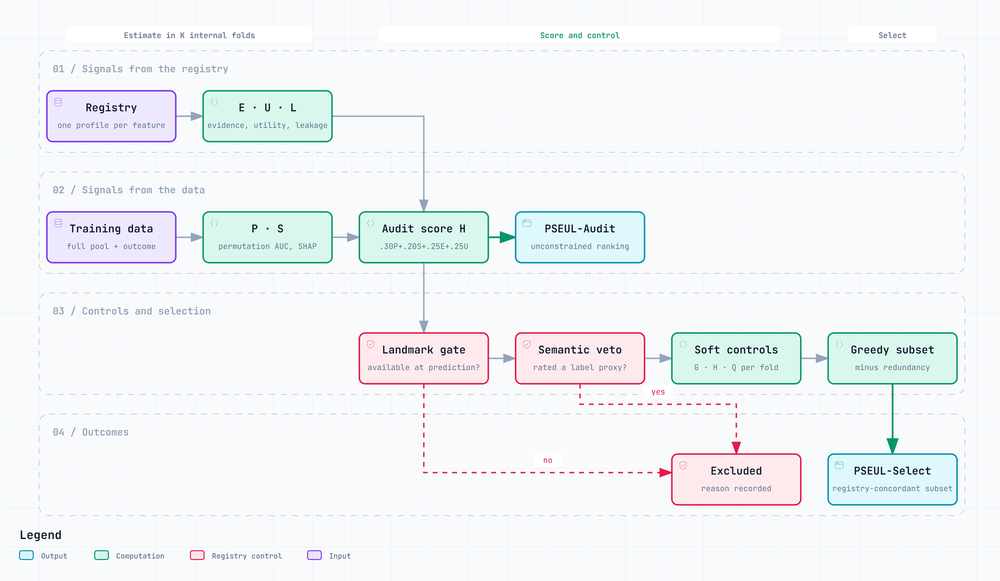

<p align="center">
  
</p>

<p align="center">
  <b>Prediction-landmark-aware feature selection for medical machine learning</b><br>
  Rank features for what they predict, then keep only the ones your registry says<br>
  exist at the moment of prediction and do not stand in for the label.
</p>

<p align="center">
  <a href="LICENSE"></a>
  
  
  <a href="https://huggingface.co/spaces/ihyaabrar/pseul"></a>
</p>

---

## Why PSEUL

A feature can be strongly predictive and clinically unusable:

- it is **recorded because the outcome happened** — a diagnosis code, a treatment
  given for the condition, a lab value that defines it;
- it **only exists after the moment the prediction is meant to be made** — the
  length of a stay, the number of follow-up visits.

Ordinary feature selection cannot tell these apart from genuine early predictors,
because all of them are strongly associated with the label. A model built on them
validates well and then fails in the setting it was built for.

PSEUL makes **prediction-time availability** and **label proximity** explicit terms of
the selection, records why every excluded feature was excluded, and reports the
discrimination that enforcing them costs instead of absorbing it into a headline
metric.

## How it works

<p align="center">
  <picture>
    <source media="(prefers-color-scheme: dark)" srcset="assets/pseul-workflow-dark.png">
    
  </picture>
</p>

The signals are estimated in K internal folds. The audit score is
H = 0.30 P + 0.20 S + 0.25 E + 0.25 U. The soft controls multiply it by a utility
gate G = min(1, U / θ_U) and a leakage penalty Q = 1 − σ(τ_L · (L − θ_L)), where
θ_L is recalibrated in each fold from the leakage scores of the pool you pass.
Greedy selection subtracts λ · redundancy (plus an uncertainty term that is off by
default) and stops at `top_k` or when the best score falls below τ_S. The diagram
source is [`docs/pseul-workflow.archify.json`](docs/pseul-workflow.archify.json).
The interactive version is [`docs/pseul-workflow.html`](docs/pseul-workflow.html).

Two outputs answer two different questions:

| output | answers | constrained by the registry? |
|---|---|---|
| **PSEUL-Audit** | Which features drive the discrimination I am seeing? | no |
| **PSEUL-Select** | Which features may I actually use at the prediction landmark? | yes |

When the two disagree, the gap is the point: it shows how much apparent performance
came from features that could not be used in practice.

## Install

```bash
pip install "pseul[lightgbm] @ git+https://github.com/ihyaabrar/pseul.git"
```

Python 3.10 or later. The `lightgbm` extra installs the learner the study used; see
[Which models work](#which-models-work) for the others.

## Which models work

PSEUL fits a classifier inside its own folds to score the features, and computes
SHAP stability with `shap.TreeExplainer`. That internal classifier therefore has to
be **tree-based**. Tested:

| works | does not work |
|---|---|
| LightGBM · XGBoost | logistic regression |
| random forest · extra trees | support vector machines |
| gradient boosting · HistGradientBoosting | k-nearest neighbours |
| decision tree | neural networks (MLP) |

The others fail with `Model type not yet supported by TreeExplainer`. The selected
subsets differ between learners, because each ranks the admissible features its own
way; the registry's exclusions hold in all of them.

This constrains only the model PSEUL uses to *choose* features. The model you train
afterwards on `selector.transform(X)` can be anything, a logistic regression included.

## Quickstart

```python
from lightgbm import LGBMClassifier
from pseul import PSEUL, PseulConfig, PseulFeatureProfile

registry = {name: PseulFeatureProfile() for name in X.columns}
registry["DIAGNOSIS_CODE"] = PseulFeatureProfile(label_derived_risk=0.95,
                                                 definitional_overlap=0.95)
registry["FOLLOWUP_VISITS"] = PseulFeatureProfile(available_at_prediction=False)

selector = PSEUL(estimator=LGBMClassifier(verbose=-1),
                 clinical_profile=registry,
                 config=PseulConfig(top_k=5))
selector.fit(X_train, y_train)

selector.selected_features_                      # PSEUL-Select
selector.select_features(mode="audit", top_k=5)  # PSEUL-Audit
selector.summary()                               # every score, per feature
X_small = selector.transform(X_test)
```

[`examples/quickstart.py`](examples/quickstart.py) runs this end to end on the
breast-cancer data with two leaky features added — a label proxy and a
post-landmark variable. Its output:

```
PSEUL-Select: ['WORST_SMOOTHNESS', 'MEAN_TEXTURE', 'MEAN_RADIUS', 'SYMMETRY_ERROR', 'CONCAVITY_ERROR']
PSEUL-Audit (ranked without the contract): ['DIAGNOSIS_CODE', 'MEAN_RADIUS', ...]

Audit top-5   held-out AUC 0.997
Select top-5  held-out AUC 0.982
```

The audit ranking puts the label proxy first. PSEUL-Select excludes it and the
post-landmark variable, and the 0.015 AUC it gives up is reported, not hidden.

## The registry

Each feature gets a `PseulFeatureProfile`. Every score is in [0, 1]; features
without a profile get neutral defaults.

| field | feeds | meaning |
|---|---|---|
| `available_at_prediction` | landmark gate | `False` excludes the feature outright |
| `label_derived_risk` · `definitional_overlap` · `target_proxy_strength` | semantic veto, leakage risk | the veto fires when any of the three reaches τ_V = 0.85 |
| `evidence` · `topic_similarity` | evidence relevance **E** | blended at η = 0.50 |
| `intervention_availability` · `risk_stratification` · `operational_feasibility` | clinical utility **U** | averaged |
| `interpretation` | — | free text, carried into the summary |

`PseulConfig()` holds the parameters locked for the study: audit weights
α, β, γ, δ = 0.30, 0.20, 0.25, 0.25; veto threshold τ_V = 0.85; score floor
τ_S = 0.20; penalty steepness τ_L = 10. The rest are documented in the class.

### A control run: what does the registry contribute?

Rerunning with the three leakage ratings set to zero shows how much of the
exclusion came from the registry rather than from the data:

```python
from dataclasses import replace

nulled = {name: replace(profile, label_derived_risk=0.0,
                        definitional_overlap=0.0, target_proxy_strength=0.0)
          for name, profile in registry.items()}
control = PSEUL(estimator=LGBMClassifier(verbose=-1), clinical_profile=nulled,
                config=PseulConfig(top_k=5)).fit(X_train, y_train)
```

On the quickstart data, the control puts `DIAGNOSIS_CODE` straight back at the top of
the subset. `FOLLOWUP_VISITS` stays out, because availability is not a leakage rating.
In the study this control, called PSEUL-Auto, put both NHANES definitional traps
and three of the four BRFSS skip-pattern traps back into the selected subset —
which is exactly why the next section matters.

## Read this before you use it

> [!IMPORTANT]
> **PSEUL does not detect leakage.** It enforces what the registry declares. A
> label proxy with neutral ratings is scored like any other feature, and if it
> predicts well it will be selected. The quality of the output is the quality of
> the registry.

> [!WARNING]
> **Pass the full candidate pool.** The leakage threshold θ_L is calibrated from the
> leakage scores of whatever features you pass to `fit()`. It is relative, not an
> absolute safety bound. Removing the most leakage-prone features beforehand makes
> θ_L recalibrate downward and can make the remainder look falsely safe.

> [!NOTE]
> **τ_V is a policy setting, not a calibrated probability.** In the study, one
> scenario's result held only for τ_V between 0.80 and 0.90. A sweep over τ_V on
> your own data is worth the few minutes it takes.

## In the study

PSEUL was evaluated in five scenarios under one nested protocol: a
medication-adherence cohort, NHANES 2021–2023, BRFSS 2024, and the UCI Diabetes 130
benchmark audited at two prediction landmarks.

| scenario | all features | PSEUL-Select | what the registry removed |
|---|---|---|---|
| Adherence | 0.901 | 0.837 | the high-risk proxy; a moderate-risk proxy stayed |
| NHANES | 0.947 | 0.793 | both definitional traps |
| BRFSS | 1.000 | 0.793 | all four skip-pattern traps |
| D130, admission | 0.636 | 0.572 | all 11 variables unavailable at admission |
| D130, discharge | 0.642 | 0.619 | nothing to remove |

*Pooled out-of-fold ROC AUC.* The drops are the discrimination that came from
features the registry declared unusable. The Diabetes 130 landmarks demonstrate
landmark enforcement, not clinically useful readmission prediction.

## Try it without installing

The [Hugging Face demo](https://huggingface.co/spaces/ihyaabrar/pseul) runs PSEUL in
the browser: upload a CSV and an optional registry, and see the audit ranking beside
the selected subset. Its source is in [`hf_space/`](hf_space/).

## Tests

```bash
pip install -e ".[dev]"
pytest
```

The tests check that the method is the frozen version the study ran and that the
registry's hard controls hold. `pseul/core.py` is a byte-for-byte copy of the study's
`scripts/pseul.py` at commit `f7eb485`; a test fails if it is edited without updating
that record.

## Citing

The paper describing PSEUL is under review. Until it appears, please cite this
repository using [`CITATION.cff`](CITATION.cff).

## Licence

[MIT](LICENSE)
